# React Native Patika Weather App

The project is a mobile application that allows users to view hourly and weekly weather data based on the user's location on their phone, with hourly data available in three-hour intervals. Bare React Native is used as the React Native CLI.


## Features

- This project is a React Native mobile application that allows users to view hourly and weekly weather data based on the user's location on their phone, with hourly data available in three-hour intervals. Bare React Native is used as the React Native CLI.
- Users can use the application as long as they grant location permission.
- Internet connectivity is required while using the application, and this status is checked in real-time.
- Users can change the temperature, pressure, and wind speed units in the weather data to match their preferred unit of measurement (e.g., Celsius, Fahrenheit, or Kelvin).
- Users can also change the language of the application.
- Users can access information about the application or its privacy policy from the settings screen.


## Screenshots

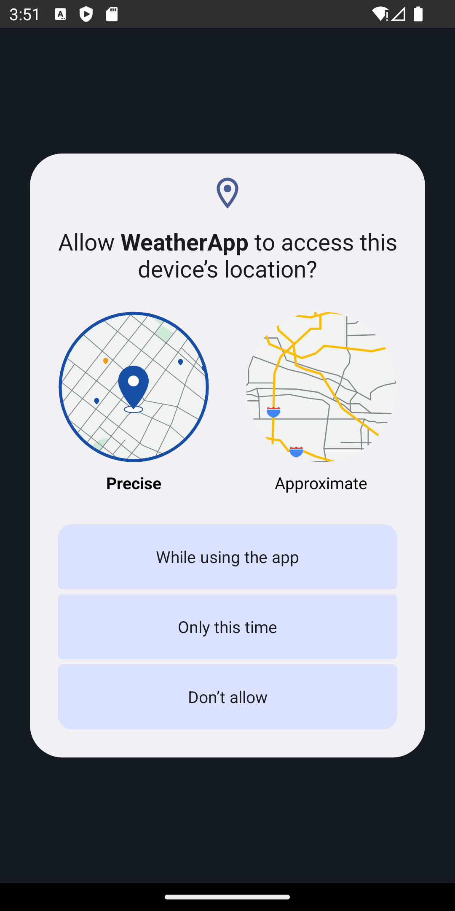


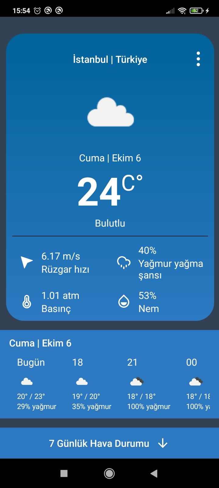
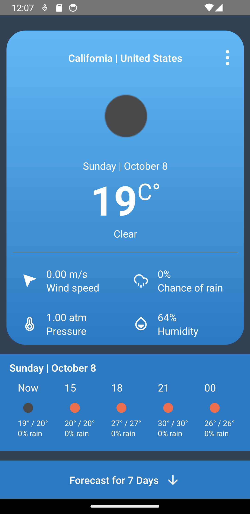
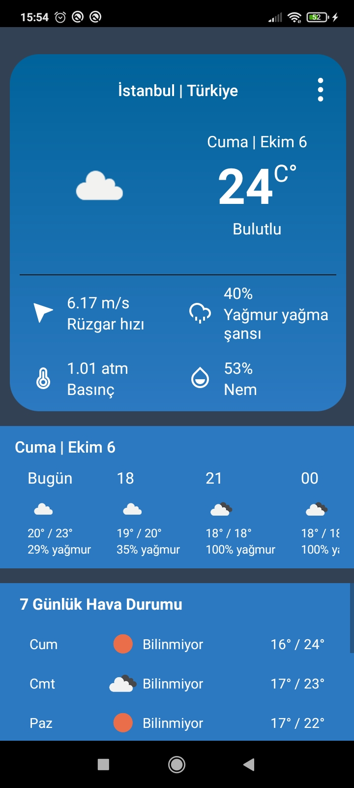
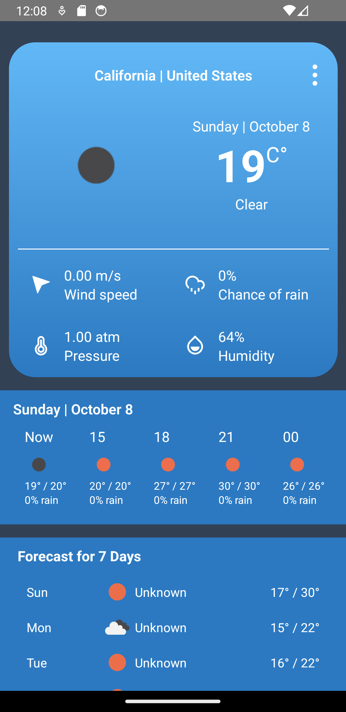
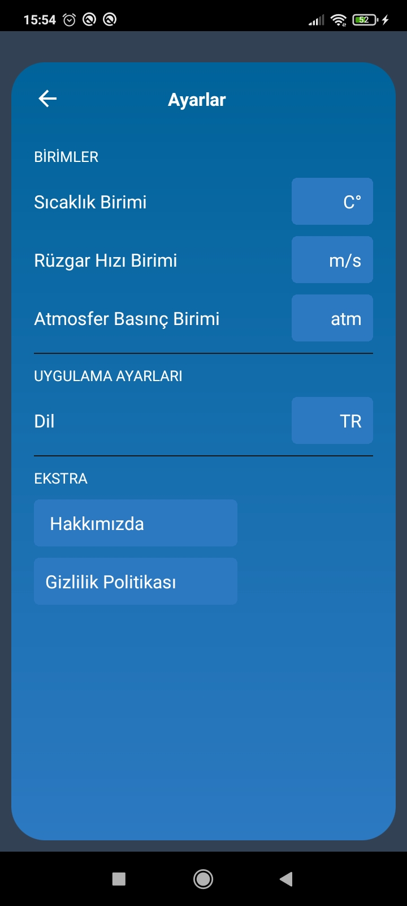

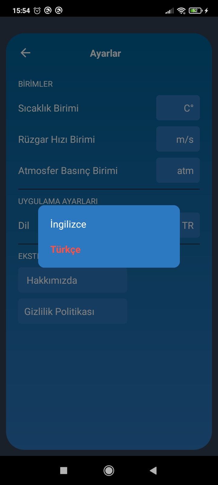
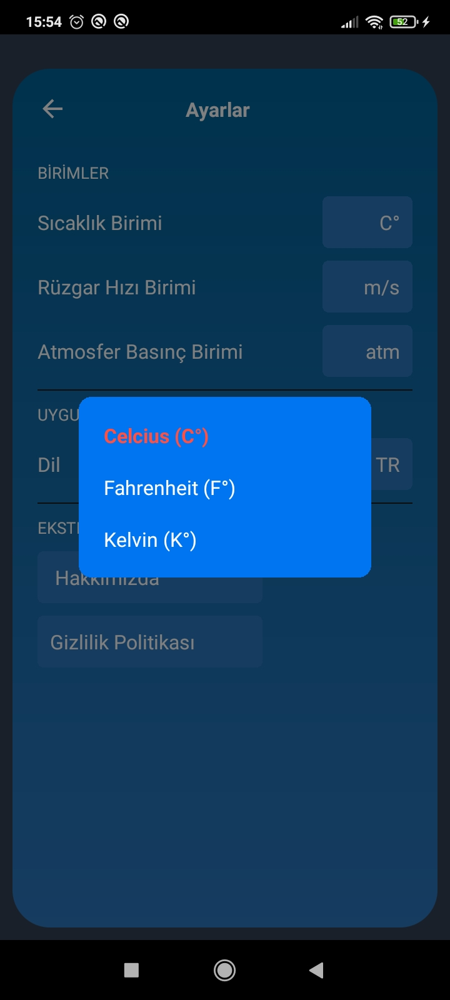
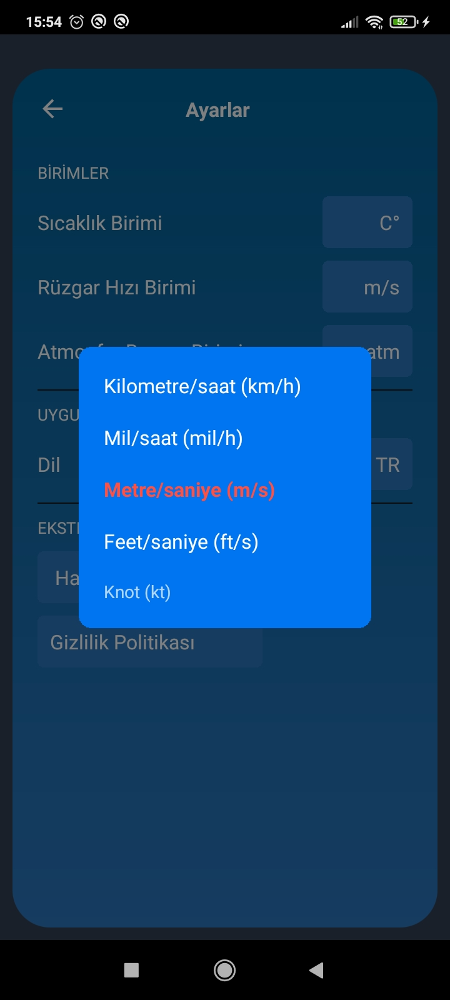
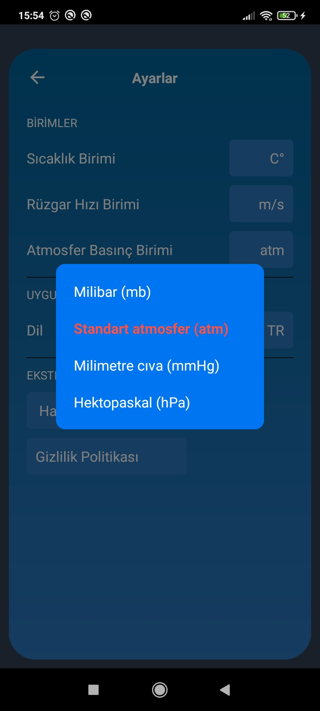
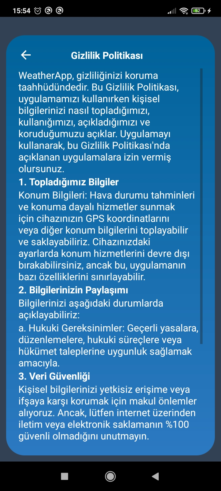
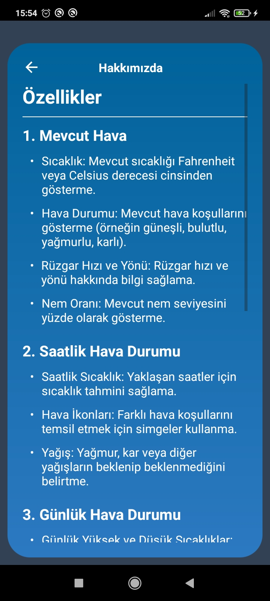


## Design
The design is based on the FIGMA design available at [this link](https://www.figma.com/community/file/1047722264278445552/weather-mobile-app-design)

To test it on an Android device, you can download the APK from [this link](./android/app/build/outputs/apk/release/app-release.apk).


## Installation

To run the Todo app on your local machine, you need to have Node.js and npm installed. You also need to have an Android or iOS emulator installed on your computer or a physical device connected to your computer. Follow these steps to install and run the application:

1. Clone the repository:

   ```bash
   git clone https://github.com/yusufie/react-native-patika-weather.git
    ```

2. Navigate to the project directory:

   ```bash
   cd react-native-patika-weather
   ```

3. Install the dependencies:

   ```bash
    npm install
    ```

4. Run the development server:

   ```bash
   npm run start
   ```

6. Run the application on an emulator or a physical device:

   ```bash
   npm run android
   ```

   or

   ```bash
   npm run ios
   ```

Open the emulator or connect your physical device to your computer to run the application. The application will be automatically installed and launched on the device.


## Contributing

Contributions are welcome! If you find any issues or have suggestions for improvements, please open an issue or submit a pull request. Follow these steps to contribute:

1. Fork the repository.
2. Create a new branch for your feature or bug fix.
3. Make the necessary changes and commit those changes.
4. Push your code to your forked repository.
5. Submit a pull request describing the changes you made.